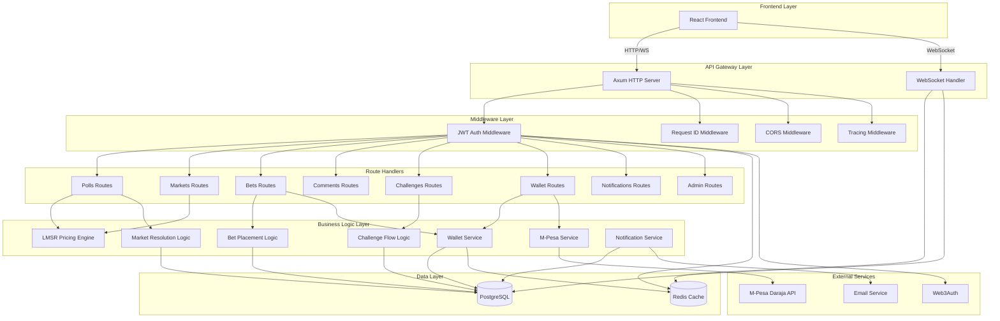
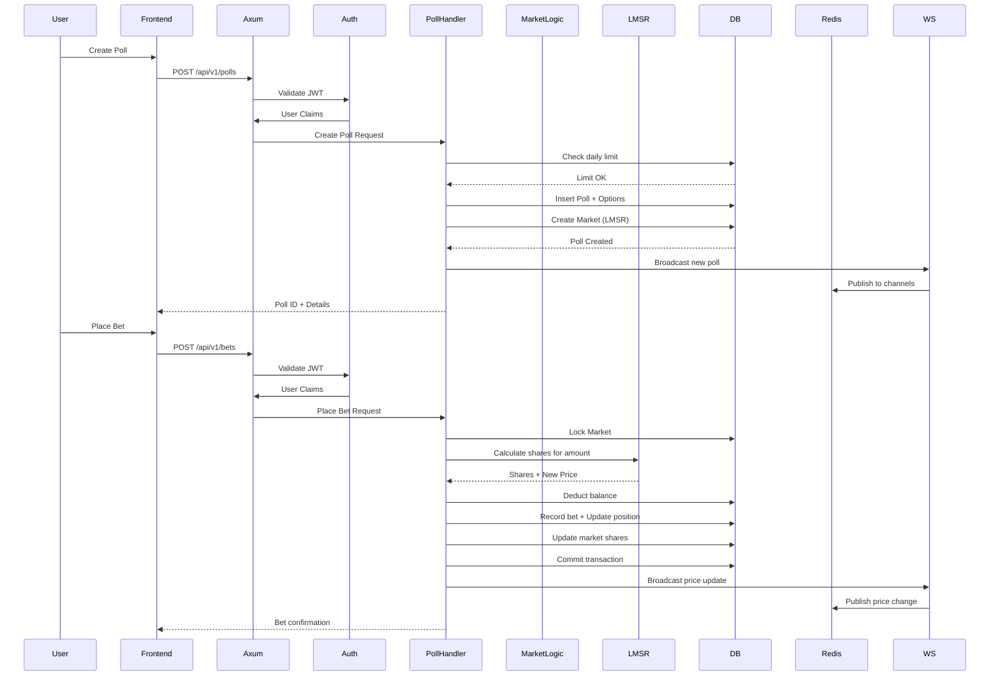
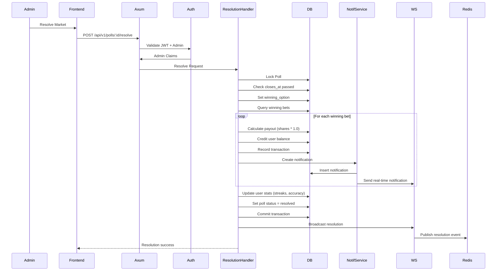
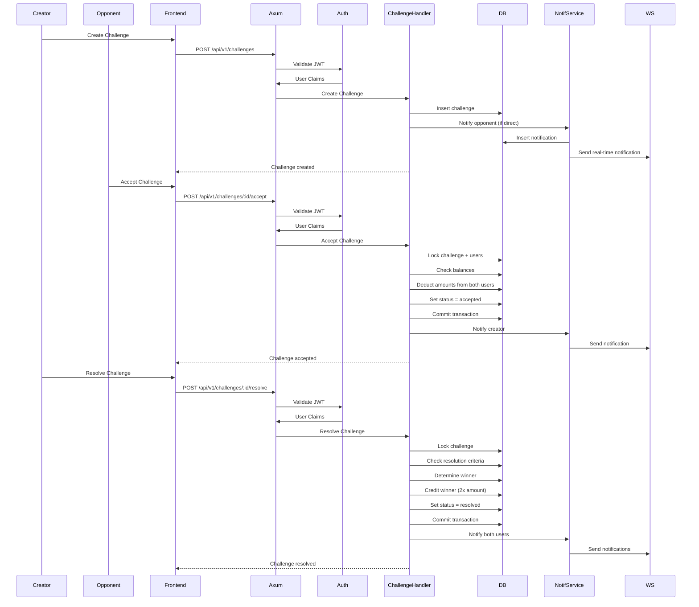
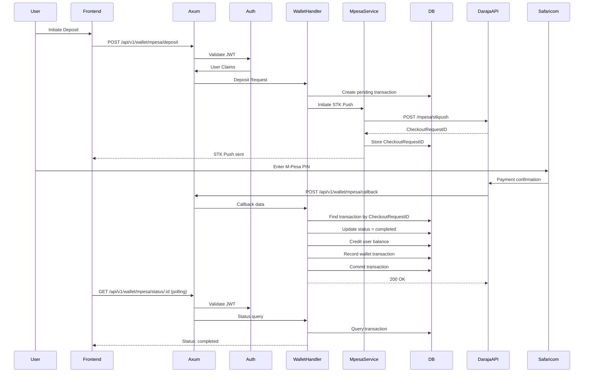

# Design Document: Rust Backend Migration for PolyPulse

## Overview

This design document outlines the complete migration of the PolyPulse prediction market platform from Python Django to Rust with Axum. PolyPulse is a prediction market and polling platform that enables users to create markets, place bets using LMSR pricing, manage wallets with M-Pesa integration, participate in challenges, and interact through comments and notifications. The migration aims to improve performance, type safety, and maintainability while preserving all existing functionality.

The Rust backend already has foundational infrastructure including database models, authentication flows (JWT, NEAR wallet, omnichain wallets), basic route structure, LMSR pricing logic, and service layers for wallet operations and M-Pesa integration. This design focuses on completing the remaining API endpoints, business logic, WebSocket support, and ensuring feature parity with the Django implementation.

## Architecture

### High-Level System Architecture



### Component Responsibilities

#### API Gateway Layer
- **Axum HTTP Server**: Main HTTP server handling REST API requests
- **WebSocket Handler**: Real-time bidirectional communication for live updates

#### Middleware Layer
- **JWT Auth Middleware**: Validates JWT tokens, extracts user claims, enforces authentication
- **Request ID Middleware**: Assigns unique IDs to requests for tracing
- **CORS Middleware**: Handles cross-origin requests from frontend
- **Tracing Middleware**: Structured logging for observability

#### Route Handlers
- **Polls Routes**: CRUD operations for polls/markets
- **Markets Routes**: Market-specific operations (price queries, history)
- **Bets Routes**: Bet placement, share selling, position queries
- **Comments Routes**: Comment creation, replies, likes
- **Challenges Routes**: Challenge creation, acceptance, resolution
- **Wallet Routes**: Balance queries, transaction history, M-Pesa deposits
- **Notifications Routes**: Notification listing, marking as read
- **Admin Routes**: Administrative operations (market resolution, suspension)

#### Business Logic Layer
- **LMSR Pricing Engine**: Calculates share prices and costs using Logarithmic Market Scoring Rule
- **Bet Placement Logic**: Validates bets, updates positions, records transactions
- **Market Resolution Logic**: Resolves markets, calculates payouts, updates user stats
- **Challenge Flow Logic**: Manages challenge lifecycle (creation, acceptance, resolution)
- **Wallet Service**: Manages user balances, transaction recording
- **M-Pesa Service**: Integrates with Safaricom Daraja API for deposits/withdrawals
- **Notification Service**: Creates and dispatches notifications

#### Data Layer
- **PostgreSQL**: Primary data store for users, polls, bets, transactions
- **Redis**: Session storage, caching, WebSocket pub/sub

## Main Workflows

### Poll Creation and Betting Flow



### Market Resolution Flow



### Challenge Flow



### M-Pesa Deposit Flow



## Components and Interfaces

### Poll Management Component

**Purpose**: Manages poll/market lifecycle including creation, listing, detail retrieval, and status updates

**Interface**:
```rust
// Route handlers
async fn create_poll(
    State(state): State<AppState>,
    AuthUser(claims): AuthUser,
    Json(req): Json<CreatePollRequest>,
) -> AppResult<Json<CreatePollResponse>>;

async fn list_polls(
    State(state): State<AppState>,
    Query(params): Query<PollListParams>,
) -> AppResult<Json<Vec<PollListItem>>>;

async fn get_poll_detail(
    State(state): State<AppState>,
    Path(poll_id): Path<i64>,
) -> AppResult<Json<PollDetail>>;

async fn resolve_poll(
    State(state): State<AppState>,
    AuthUser(claims): AuthUser,
    Path(poll_id): Path<i64>,
    Json(req): Json<ResolvePollRequest>,
) -> AppResult<Json<ResolutionResult>>;

async fn suspend_poll(
    State(state): State<AppState>,
    AuthUser(claims): AuthUser,
    Path(poll_id): Path<i64>,
) -> AppResult<Json<StatusMessage>>;

async fn cancel_poll(
    State(state): State<AppState>,
    AuthUser(claims): AuthUser,
    Path(poll_id): Path<i64>,
) -> AppResult<Json<StatusMessage>>;
```

**Responsibilities**:
- Validate poll creation requests (daily limits, permissions)
- Create poll with options and associated market
- Query polls with filtering (category, status, creator)
- Close expired polls automatically
- Resolve markets and distribute payouts
- Suspend/cancel markets with refunds

### Betting Component

**Purpose**: Handles bet placement, share selling, and position management

**Interface**:
```rust
async fn place_bet(
    State(state): State<AppState>,
    AuthUser(claims): AuthUser,
    Json(req): Json<PlaceBetRequest>,
) -> AppResult<Json<BetResult>>;

async fn sell_shares(
    State(state): State<AppState>,
    AuthUser(claims): AuthUser,
    Path(poll_id): Path<i64>,
    Json(req): Json<SellSharesRequest>,
) -> AppResult<Json<SellResult>>;

async fn get_user_positions(
    State(state): State<AppState>,
    AuthUser(claims): AuthUser,
) -> AppResult<Json<Vec<Position>>>;

async fn get_market_prices(
    State(state): State<AppState>,
    Path(poll_id): Path<i64>,
) -> AppResult<Json<MarketPrices>>;

async fn get_price_history(
    State(state): State<AppState>,
    Path(poll_id): Path<i64>,
) -> AppResult<Json<Vec<PriceSnapshot>>>;
```

**Responsibilities**:
- Validate bet amounts and market status
- Calculate shares using LMSR
- Update user balances and positions atomically
- Record bets and wallet transactions
- Calculate refunds for share sales
- Query user positions with P&L calculations
- Provide current and historical market prices

### Challenge Component

**Purpose**: Manages challenge lifecycle from creation through resolution

**Interface**:
```rust
async fn create_challenge(
    State(state): State<AppState>,
    AuthUser(claims): AuthUser,
    Json(req): Json<CreateChallengeRequest>,
) -> AppResult<Json<ChallengeResponse>>;

async fn list_challenges(
    State(state): State<AppState>,
    AuthUser(claims): AuthUser,
    Query(params): Query<ChallengeListParams>,
) -> AppResult<Json<Vec<ChallengeListItem>>>;

async fn get_challenge_detail(
    State(state): State<AppState>,
    AuthUser(claims): AuthUser,
    Path(id): Path<i64>,
) -> AppResult<Json<ChallengeDetail>>;

async fn accept_challenge(
    State(state): State<AppState>,
    AuthUser(claims): AuthUser,
    Path(id): Path<i64>,
) -> AppResult<Json<StatusMessage>>;

async fn resolve_challenge(
    State(state): State<AppState>,
    AuthUser(claims): AuthUser,
    Path(id): Path<i64>,
    Json(req): Json<ResolveChallengeRequest>,
) -> AppResult<Json<ResolutionResult>>;

async fn cancel_challenge(
    State(state): State<AppState>,
    AuthUser(claims): AuthUser,
    Path(id): Path<i64>,
) -> AppResult<Json<StatusMessage>>;
```

**Responsibilities**:
- Create direct or open challenges
- Validate challenge parameters and linked polls
- Handle challenge acceptance with balance checks
- Manage challenge resolution with winner determination
- Process refunds for cancelled challenges
- Send notifications for challenge events

### Comment Component

**Purpose**: Manages comments, replies, and likes on polls

**Interface**:
```rust
async fn list_comments(
    State(state): State<AppState>,
    Path(poll_id): Path<i64>,
) -> AppResult<Json<Vec<CommentTree>>>;

async fn create_comment(
    State(state): State<AppState>,
    AuthUser(claims): AuthUser,
    Path(poll_id): Path<i64>,
    Json(req): Json<CreateCommentRequest>,
) -> AppResult<Json<CommentResponse>>;

async fn toggle_like(
    State(state): State<AppState>,
    AuthUser(claims): AuthUser,
    Path(comment_id): Path<i64>,
) -> AppResult<Json<LikeStatus>>;
```

**Responsibilities**:
- List comments with nested replies
- Create top-level comments and replies
- Parse and process @mentions
- Toggle likes on comments
- Return comment trees with like counts

### Wallet Component

**Purpose**: Manages user balances, transactions, and M-Pesa integration

**Interface**:
```rust
async fn get_balance(
    State(state): State<AppState>,
    AuthUser(claims): AuthUser,
) -> AppResult<Json<BalanceResponse>>;

async fn get_transactions(
    State(state): State<AppState>,
    AuthUser(claims): AuthUser,
    Query(params): Query<TransactionParams>,
) -> AppResult<Json<Vec<WalletTransaction>>>;

async fn initiate_mpesa_deposit(
    State(state): State<AppState>,
    AuthUser(claims): AuthUser,
    Json(req): Json<MpesaDepositRequest>,
) -> AppResult<Json<MpesaDepositResponse>>;

async fn mpesa_callback(
    State(state): State<AppState>,
    Json(callback): Json<MpesaCallback>,
) -> AppResult<Json<CallbackAck>>;

async fn get_mpesa_status(
    State(state): State<AppState>,
    AuthUser(claims): AuthUser,
    Path(checkout_id): Path<String>,
) -> AppResult<Json<MpesaStatus>>;
```

**Responsibilities**:
- Query user balance
- List transaction history with filtering
- Initiate M-Pesa STK Push
- Handle M-Pesa callbacks
- Update balances on successful deposits
- Provide transaction status polling

### Notification Component

**Purpose**: Creates, stores, and delivers notifications to users

**Interface**:
```rust
async fn list_notifications(
    State(state): State<AppState>,
    AuthUser(claims): AuthUser,
    Query(params): Query<NotificationParams>,
) -> AppResult<Json<Vec<Notification>>>;

async fn mark_read(
    State(state): State<AppState>,
    AuthUser(claims): AuthUser,
    Path(id): Path<i64>,
) -> AppResult<Json<StatusMessage>>;

async fn mark_all_read(
    State(state): State<AppState>,
    AuthUser(claims): AuthUser,
) -> AppResult<Json<StatusMessage>>;

async fn get_unread_count(
    State(state): State<AppState>,
    AuthUser(claims): AuthUser,
) -> AppResult<Json<UnreadCount>>;
```

**Responsibilities**:
- List user notifications with pagination
- Mark individual notifications as read
- Mark all notifications as read
- Return unread count
- Send real-time notifications via WebSocket

### WebSocket Component

**Purpose**: Provides real-time updates for polls, bets, notifications, and challenges

**Interface**:
```rust
async fn ws_handler(
    ws: WebSocketUpgrade,
    State(state): State<AppState>,
    Query(params): Query<WsAuthParams>,
) -> impl IntoResponse;

// Internal message types
enum WsMessage {
    PollCreated(PollCreatedEvent),
    PriceUpdate(PriceUpdateEvent),
    BetPlaced(BetPlacedEvent),
    PollResolved(PollResolvedEvent),
    CommentAdded(CommentAddedEvent),
    ChallengeCreated(ChallengeCreatedEvent),
    ChallengeAccepted(ChallengeAcceptedEvent),
    Notification(NotificationEvent),
}

// Subscription management
async fn subscribe_to_poll(conn_id: Uuid, poll_id: i64);
async fn subscribe_to_user_notifications(conn_id: Uuid, user_id: Uuid);
async fn broadcast_to_poll(poll_id: i64, message: WsMessage);
async fn send_to_user(user_id: Uuid, message: WsMessage);
```

**Responsibilities**:
- Authenticate WebSocket connections via JWT
- Manage connection lifecycle
- Handle subscription requests
- Broadcast events to subscribed clients
- Send targeted notifications to specific users
- Maintain connection registry in Redis

## Data Models

### Core Entities

**User**
```rust
pub struct User {
    pub id: Uuid,
    pub username: String,
    pub email: String,
    pub password_hash: Option<String>,
    pub phone: Option<String>,
    pub balance: f64,
    pub is_staff: bool,
    pub is_active: bool,
    pub created_at: DateTime<Utc>,
}
```

**Profile**
```rust
pub struct Profile {
    pub id: i64,
    pub user_id: Uuid,
    pub avatar_url: Option<String>,
    pub email_verified: bool,
    pub current_streak: i32,
    pub best_streak: i32,
    pub total_predictions: i32,
    pub correct_predictions: i32,
    pub polls_created_today: i32,
    pub last_poll_created_date: Option<NaiveDate>,
    pub referral_code: Option<String>,
}
```

**Poll**
```rust
pub struct Poll {
    pub id: i64,
    pub creator_id: Uuid,
    pub title: String,
    pub description: String,
    pub category_id: Option<i64>,
    pub status: String, // open, closed, resolved, suspended, cancelled
    pub is_free: bool,
    pub closes_at: DateTime<Utc>,
    pub created_at: DateTime<Utc>,
    pub winning_option_id: Option<i64>,
    pub resolution_criteria: String,
}
```

**PollOption**
```rust
pub struct PollOption {
    pub id: i64,
    pub poll_id: i64,
    pub text: String,
    pub is_yes: bool,
    pub order: i16,
}
```

**Market**
```rust
pub struct Market {
    pub id: i64,
    pub poll_id: i64,
    pub liquidity_b: f64,
    pub shares_outstanding: serde_json::Value, // {option_id: shares}
}
```

**Bet**
```rust
pub struct Bet {
    pub id: i64,
    pub user_id: Uuid,
    pub poll_id: i64,
    pub option_id: i64,
    pub amount: f64,
    pub shares: f64,
    pub created_at: DateTime<Utc>,
}
```

**MarketPosition**
```rust
pub struct MarketPosition {
    pub id: i64,
    pub user_id: Uuid,
    pub market_id: i64,
    pub option_shares: serde_json::Value, // {option_id: shares}
    pub option_spent: serde_json::Value,  // {option_id: amount_spent}
    pub created_at: DateTime<Utc>,
}
```

**Challenge**
```rust
pub struct Challenge {
    pub id: i64,
    pub creator_id: Uuid,
    pub opponent_id: Option<Uuid>,
    pub question: String,
    pub amount: Decimal,
    pub creator_choice: String,
    pub status: String, // pending, accepted, resolved, cancelled, expired
    pub is_open: bool,
    pub poll_id: Option<i64>,
    pub expires_at: DateTime<Utc>,
    pub resolved_at: Option<DateTime<Utc>>,
    pub winner_id: Option<Uuid>,
    pub resolution_criteria: String,
    pub created_at: DateTime<Utc>,
}
```

**WalletTransaction**
```rust
pub struct WalletTransaction {
    pub id: i64,
    pub user_id: Uuid,
    pub amount: f64,
    pub transaction_type: String, // deposit, bet, win, refund, withdrawal
    pub balance_after: f64,
    pub description: String,
    pub related_poll_id: Option<i64>,
    pub related_bet_id: Option<i64>,
    pub created_at: DateTime<Utc>,
}
```

**MpesaTransaction**
```rust
pub struct MpesaTransaction {
    pub id: i64,
    pub user_id: Uuid,
    pub transaction_type: String, // deposit, withdrawal
    pub phone: String,
    pub amount: i32,
    pub checkout_request_id: String,
    pub merchant_request_id: String,
    pub mpesa_receipt: String,
    pub status: String, // pending, completed, failed, cancelled
    pub result_desc: String,
    pub created_at: DateTime<Utc>,
    pub updated_at: DateTime<Utc>,
}
```

**Notification**
```rust
pub struct Notification {
    pub id: i64,
    pub user_id: Uuid,
    pub actor_id: Option<Uuid>,
    pub notification_type: String,
    pub message: String,
    pub is_read: bool,
    pub created_at: DateTime<Utc>,
}
```

**PollComment**
```rust
pub struct PollComment {
    pub id: i64,
    pub poll_id: i64,
    pub user_id: Uuid,
    pub content: String,
    pub parent_id: Option<i64>,
    pub created_at: DateTime<Utc>,
}
```

## Error Handling

### Error Types

```rust
pub enum AppError {
    // Client errors (4xx)
    BadRequest(String),
    Unauthorized(String),
    Forbidden(String),
    NotFound(String),
    Conflict(String),
    
    // Server errors (5xx)
    InternalServerError(String),
    Database(sqlx::Error),
    Redis(redis::RedisError),
    
    // External service errors
    MpesaError(String),
    EmailError(String),
}
```

### Error Scenarios

**Insufficient Balance**
- **Condition**: User attempts to place bet or accept challenge with insufficient funds
- **Response**: 400 Bad Request with error message
- **Recovery**: User must deposit funds or reduce bet amount

**Market Closed**
- **Condition**: User attempts to bet on closed/resolved market
- **Response**: 403 Forbidden with time remaining or resolution status
- **Recovery**: User can only sell existing shares

**Invalid Nonce**
- **Condition**: Wallet authentication with expired/used nonce
- **Response**: 401 Unauthorized
- **Recovery**: Request new nonce and retry

**M-Pesa Timeout**
- **Condition**: User doesn't complete STK Push within timeout
- **Response**: Transaction marked as failed/cancelled
- **Recovery**: User can retry deposit

**Concurrent Bet Conflict**
- **Condition**: Multiple users betting simultaneously causing race condition
- **Response**: Database transaction retry or 409 Conflict
- **Recovery**: Automatic retry with exponential backoff

## Testing Strategy

### Unit Testing Approach

**LMSR Pricing Tests**
- Test cost function symmetry
- Verify prices sum to 1.0
- Test share calculation roundtrips
- Verify refund calculations
- Edge cases: zero shares, single option, large numbers

**Wallet Transaction Tests**
- Test balance updates
- Verify transaction recording
- Test concurrent transaction handling
- Verify rollback on errors

**Authentication Tests**
- Test JWT generation and validation
- Test nonce generation and expiry
- Test signature verification (ed25519)
- Test refresh token rotation

### Integration Testing Approach

**Poll Lifecycle Tests**
- Create poll → place bets → resolve → verify payouts
- Test daily poll creation limits
- Test poll expiration and auto-close
- Test suspension and cancellation with refunds

**Challenge Flow Tests**
- Create challenge → accept → resolve → verify winner payout
- Test open challenge acceptance
- Test challenge expiration
- Test cancellation with refunds

**M-Pesa Integration Tests**
- Mock Daraja API responses
- Test STK Push initiation
- Test callback processing
- Test status polling
- Test failure scenarios

### Property-Based Testing Approach

**Property Test Library**: proptest (Rust)

**LMSR Properties**
- Property: For any bet amount, resulting price must be between 0 and 1
- Property: Sum of all option prices must equal 1.0
- Property: Buying then selling same shares should return approximately same amount (minus fees)
- Property: Market cost function must be monotonically increasing

**Wallet Properties**
- Property: Sum of all transaction amounts must equal current balance
- Property: Balance can never go negative
- Property: Every debit must have corresponding credit somewhere in system

**Challenge Properties**
- Property: Total challenge pool (2x amount) must be distributed exactly once
- Property: Challenge status transitions must follow valid state machine

## Performance Considerations

### Database Optimization
- Use connection pooling (sqlx with max 20 connections)
- Index frequently queried columns (user_id, poll_id, status, created_at)
- Use SELECT FOR UPDATE for critical sections (market updates, balance changes)
- Batch insert notifications and price snapshots
- Use prepared statements for repeated queries

### Caching Strategy
- Cache user sessions in Redis (7-day TTL)
- Cache poll details for 30 seconds
- Cache market prices for 5 seconds
- Invalidate cache on updates via Redis pub/sub
- Use Redis for WebSocket connection registry

### Concurrency Handling
- Use database transactions for atomic operations
- Implement optimistic locking for market updates
- Use row-level locks for balance updates
- Queue M-Pesa callbacks for sequential processing
- Rate limit API endpoints (60/min anon, 300/min authenticated)

### WebSocket Scalability
- Use Redis pub/sub for multi-instance coordination
- Limit connections per user (max 5)
- Implement heartbeat/ping-pong for connection health
- Use binary protocol for efficiency
- Batch broadcast messages

## Security Considerations

### Authentication & Authorization
- JWT tokens with 30-minute expiry
- Refresh tokens with 7-day expiry, stored in Redis
- Ed25519 signature verification for wallet auth
- Nonce-based replay attack prevention (5-minute expiry)
- Role-based access control (is_staff, is_active checks)

### Input Validation
- Validate all user inputs (username length, email format, amounts)
- Sanitize comment content to prevent XSS
- Validate poll options (min 2, max 10)
- Enforce bet amount limits (min 1, max balance)
- Validate phone numbers for M-Pesa

### Rate Limiting
- Anonymous: 60 requests/minute
- Authenticated: 300 requests/minute
- Auth endpoints: 10 requests/minute
- Trading endpoints: 30 requests/minute
- M-Pesa deposits: 5 requests/minute

### Data Protection
- Hash passwords with Argon2
- Store sensitive config in environment variables
- Use HTTPS in production
- Sanitize error messages (no stack traces to clients)
- Log security events (failed logins, suspicious activity)

### M-Pesa Security
- Validate callback signatures from Safaricom
- Use HTTPS for callback URL
- Store API credentials securely
- Implement idempotency for callbacks
- Rate limit deposit attempts

## Dependencies

### Core Dependencies
- **axum**: Web framework (v0.7)
- **tokio**: Async runtime (v1.35)
- **sqlx**: Database driver with compile-time query checking (v0.7)
- **redis**: Redis client (v0.24)
- **serde**: Serialization framework (v1.0)
- **serde_json**: JSON support (v1.0)

### Authentication
- **jsonwebtoken**: JWT encoding/decoding (v9.2)
- **argon2**: Password hashing (v0.5)
- **ed25519-dalek**: Ed25519 signature verification (v2.1)
- **rand**: Random number generation (v0.8)

### HTTP & Networking
- **tower**: Middleware framework (v0.4)
- **tower-http**: HTTP middleware (CORS, tracing, compression) (v0.5)
- **hyper**: HTTP implementation (v1.0)
- **reqwest**: HTTP client for external APIs (v0.11)

### WebSocket
- **axum-tungstenite**: WebSocket support for Axum (v0.7)
- **tokio-tungstenite**: Async WebSocket (v0.21)

### Utilities
- **chrono**: Date/time handling (v0.4)
- **uuid**: UUID generation (v1.6)
- **tracing**: Structured logging (v0.1)
- **tracing-subscriber**: Log formatting (v0.3)
- **anyhow**: Error handling (v1.0)
- **thiserror**: Custom error types (v1.0)

### External Services
- **lettre**: Email sending (v0.11)
- **base64**: Base64 encoding/decoding (v0.21)
- **hex**: Hex encoding/decoding (v0.4)

### Testing
- **proptest**: Property-based testing (v1.4)
- **mockall**: Mocking framework (v0.12)
- **wiremock**: HTTP mocking for integration tests (v0.6)

### Configuration
- **dotenvy**: .env file loading (v0.15)
- **config**: Configuration management (v0.14)

## Correctness Properties

### Universal Quantification Statements

1. **Market Integrity**: ∀ markets m, ∑(prices of all options in m) = 1.0 ± ε
2. **Balance Conservation**: ∀ users u, balance(u) = initial_balance + ∑(credits) - ∑(debits)
3. **Bet Validity**: ∀ bets b, b.amount ≤ user.balance at time of bet placement
4. **Share Conservation**: ∀ markets m, ∀ options o, shares_outstanding(o) = ∑(user_positions.shares for o)
5. **Payout Correctness**: ∀ resolved polls p, ∑(payouts) = ∑(winning_bets.shares) * 1.0
6. **Challenge Pool**: ∀ resolved challenges c, winner_payout = 2 * c.amount
7. **Transaction Atomicity**: ∀ operations op, either all state changes commit or all rollback
8. **Status Transitions**: ∀ polls p, status transitions follow: open → closed → resolved (or suspended/cancelled)
9. **Authentication**: ∀ protected endpoints e, request must have valid JWT with unexpired claims
10. **Nonce Uniqueness**: ∀ nonces n, n can be used exactly once before expiry

### Invariants

- User balance ≥ 0 at all times
- Poll must have at least 2 options
- Market liquidity_b > 0
- Bet amount > 0
- Challenge amount > 0
- Winning option must be one of poll's options
- Poll cannot be resolved before closes_at
- Challenge cannot be resolved before expires_at (unless linked to poll)
- M-Pesa transaction status transitions: pending → (completed | failed | cancelled)
- WebSocket connections must authenticate within 30 seconds

## Migration Checklist

### Phase 1: Core API Endpoints
- [ ] Complete polls CRUD endpoints
- [ ] Implement betting endpoints (place bet, sell shares)
- [ ] Add position and portfolio queries
- [ ] Implement market price queries and history

### Phase 2: Social Features
- [ ] Comments endpoints (list, create, reply)
- [ ] Comment likes toggle
- [ ] Mention parsing and notification
- [ ] Notification endpoints (list, mark read, count)

### Phase 3: Challenges
- [ ] Challenge CRUD endpoints
- [ ] Challenge acceptance logic
- [ ] Challenge resolution logic
- [ ] Challenge cancellation with refunds

### Phase 4: Admin Features
- [ ] Poll resolution endpoint
- [ ] Poll suspension endpoint
- [ ] Poll cancellation endpoint
- [ ] Leaderboard endpoint
- [ ] Stats endpoint

### Phase 5: WebSocket
- [ ] WebSocket connection handler
- [ ] Authentication for WebSocket
- [ ] Subscription management
- [ ] Event broadcasting (polls, bets, prices)
- [ ] Real-time notifications

### Phase 6: Testing
- [ ] Unit tests for LMSR
- [ ] Unit tests for wallet service
- [ ] Integration tests for poll lifecycle
- [ ] Integration tests for challenge flow
- [ ] Property-based tests for market integrity
- [ ] M-Pesa integration tests (mocked)

### Phase 7: Performance & Security
- [ ] Add database indexes
- [ ] Implement caching layer
- [ ] Add rate limiting
- [ ] Security audit (input validation, auth)
- [ ] Load testing

### Phase 8: Deployment
- [ ] Docker configuration
- [ ] Database migration scripts
- [ ] Environment configuration
- [ ] Monitoring and logging setup
- [ ] CI/CD pipeline
