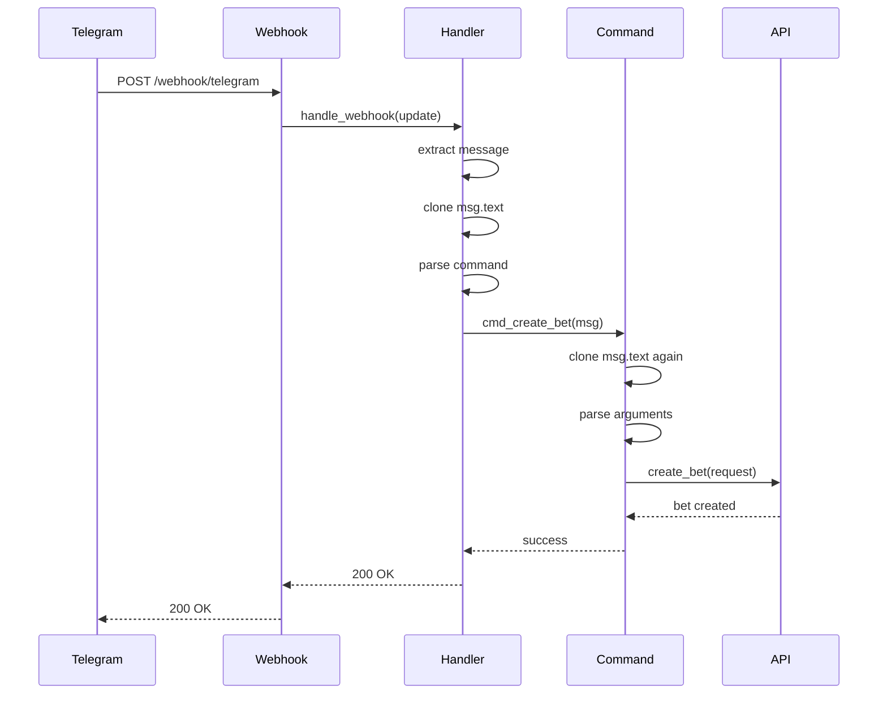

# Design Document: Backend Rust Compilation Fix

## Overview

This document provides the technical design for fixing 32 Rust compilation errors in the PolyPulse backend's Telegram bot service. The primary issue is Rust ownership violations where `msg.text` is moved and then used again, violating Rust's single-ownership rule.

## Architecture

### Current Architecture (Broken)

```
TelegramBot::handle_webhook()
  ↓
TelegramBot::handle_message(msg)
  ↓
  msg.text.ok_or() → MOVES msg.text
  ↓
  match command → calls cmd_* functions
  ↓
  cmd_create_bet(msg) → tries to access msg.text
  ↓
  ERROR: msg.text was already moved!
```

### Fixed Architecture

```
TelegramBot::handle_webhook()
  ↓
TelegramBot::handle_message(msg)
  ↓
  msg.text.clone().ok_or() → CLONES before moving
  ↓
  match command → calls cmd_* functions
  ↓
  cmd_create_bet(msg) → can still access msg.text
  ↓
  SUCCESS: msg.text is still available!
```

## Component Design

### 1. Message Handler

**File**: `backend/src/services/telegram_bot.rs`

**Current Implementation** (Broken):
```rust
async fn handle_message(&self, msg: TelegramMessage) -> Result<(), BotError> {
    // This moves msg.text out of msg
    let text = msg.text.ok_or(BotError::NoText)?;
    let parts: Vec<&str> = text.split_whitespace().collect();

    match parts.first() {
        Some(&"/start") => self.cmd_start(msg.chat.id, msg.from).await,
        Some(&"/bet") => self.cmd_create_bet(msg).await, // ERROR: msg.text is moved
        // ...
    }
}
```

**Fixed Implementation**:
```rust
async fn handle_message(&self, msg: TelegramMessage) -> Result<(), BotError> {
    // Clone msg.text before moving
    let text = msg.text.clone().ok_or(BotError::NoText)?;
    let parts: Vec<&str> = text.split_whitespace().collect();

    match parts.first() {
        Some(&"/start") => self.cmd_start(msg.chat.id, msg.from).await,
        Some(&"/bet") => self.cmd_create_bet(msg).await, // OK: msg.text still available
        // ...
    }
}
```

**Rationale**: Cloning `msg.text` creates a new `Option<String>` that can be moved without affecting the original `msg.text`. This allows command handlers to still access `msg.text` if needed.

### 2. Command Handlers

**Current Implementation** (Broken):
```rust
async fn cmd_create_bet(&self, msg: TelegramMessage) -> Result<(), BotError> {
    // ERROR: msg.text was already moved in handle_message
    let text = msg.text.unwrap();
    let parts: Vec<&str> = text.split_whitespace().collect();
    // ...
}
```

**Fixed Implementation** (Option A - Clone):
```rust
async fn cmd_create_bet(&self, msg: TelegramMessage) -> Result<(), BotError> {
    // Clone before unwrapping
    let text = msg.text.clone().unwrap();
    let parts: Vec<&str> = text.split_whitespace().collect();
    // ...
}
```

**Fixed Implementation** (Option B - Pass text):
```rust
async fn handle_message(&self, msg: TelegramMessage) -> Result<(), BotError> {
    let text = msg.text.clone().ok_or(BotError::NoText)?;
    let parts: Vec<&str> = text.split_whitespace().collect();

    match parts.first() {
        Some(&"/bet") => self.cmd_create_bet(msg, &text).await, // Pass text
        // ...
    }
}

async fn cmd_create_bet(&self, msg: TelegramMessage, text: &str) -> Result<(), BotError> {
    // Use passed text instead of accessing msg.text
    let parts: Vec<&str> = text.split_whitespace().collect();
    // ...
}
```

**Recommendation**: Use Option A (clone) for simplicity. Option B is more efficient but requires changing function signatures.

### 3. Unused Variables

**Current Implementation** (Warning):
```rust
async fn cmd_create_bet(&self, msg: TelegramMessage) -> Result<(), BotError> {
    // ...
    let share_url = format!("https://t.me/polypulse_bot?start=bet_{}", bet_id);
    // share_url is never used - WARNING
    
    self.send_bet_card(msg.chat.id, &bet, &share_url).await
}
```

**Fixed Implementation** (Option A - Use it):
```rust
async fn cmd_create_bet(&self, msg: TelegramMessage) -> Result<(), BotError> {
    // ...
    let share_url = format!("https://t.me/polypulse_bot?start=bet_{}", bet_id);
    
    // Actually use share_url
    self.send_bet_card(msg.chat.id, &bet, &share_url).await
}
```

**Fixed Implementation** (Option B - Prefix with underscore):
```rust
async fn cmd_create_bet(&self, msg: TelegramMessage) -> Result<(), BotError> {
    // ...
    let _share_url = format!("https://t.me/polypulse_bot?start=bet_{}", bet_id);
    // Underscore prefix tells Rust "I know this is unused"
    
    self.send_bet_card(msg.chat.id, &bet, "").await
}
```

**Fixed Implementation** (Option C - Remove it):
```rust
async fn cmd_create_bet(&self, msg: TelegramMessage) -> Result<(), BotError> {
    // ...
    // Just remove the unused variable
    
    self.send_bet_card(msg.chat.id, &bet, "").await
}
```

**Recommendation**: Use Option A if the variable should be used, Option C if it's truly unnecessary.

## Data Flow

### Message Processing Flow



### Ownership Flow

```
Original msg
  ├─ msg.text (Option<String>)
  │    ├─ .clone() → Creates new Option<String>
  │    │    └─ .ok_or() → Moves cloned value
  │    └─ Original msg.text still available
  │
  └─ Pass msg to command handler
       └─ msg.text.clone() → Creates another clone
            └─ .unwrap() → Moves this clone
```

## Implementation Plan

### Phase 1: Fix Primary Errors (Lines 89, 143)

**File**: `backend/src/services/telegram_bot.rs`

**Changes**:
1. Line 89: Change `msg.text.ok_or()` to `msg.text.clone().ok_or()`
2. Line 143: Change `msg.text.unwrap()` to `msg.text.clone().unwrap()`
3. Find all other `msg.text` accesses and add `.clone()`

**Search Pattern**:
```bash
grep -n "msg\.text" backend/src/services/telegram_bot.rs
```

**Expected Matches**:
- Line 89: `let text = msg.text.ok_or(BotError::NoText)?;`
- Line 143: `let text = msg.text.unwrap();`
- Line 200+: Other potential accesses

**Fix Template**:
```rust
// Before
msg.text.ok_or(...)
msg.text.unwrap()
msg.text.expect(...)

// After
msg.text.clone().ok_or(...)
msg.text.clone().unwrap()
msg.text.clone().expect(...)
```

### Phase 2: Fix Unused Variables

**File**: `backend/src/services/telegram_bot.rs`

**Changes**:
1. Line 348: Prefix `share_url` with underscore or use it
2. Find all other unused variables

**Search Pattern**:
```bash
cargo build 2>&1 | grep "unused variable"
```

**Fix Template**:
```rust
// Before
let share_url = format!(...);

// After (if unused)
let _share_url = format!(...);

// Or (if should be used)
let share_url = format!(...);
// ... use share_url somewhere ...
```

### Phase 3: Verify Compilation

**Commands**:
```bash
cd backend
cargo clean
cargo build --release
```

**Expected Output**:
```
   Compiling backend v0.1.0 (/path/to/backend)
    Finished release [optimized] target(s) in 45.23s
```

**Success Criteria**:
- Exit code: 0
- No errors
- Zero or minimal warnings

### Phase 4: Run Tests

**Commands**:
```bash
cd backend
cargo test
```

**Expected Output**:
```
running X tests
test result: ok. X passed; 0 failed; 0 ignored
```

### Phase 5: Deploy to Render

**Steps**:
1. Commit changes to Git
2. Push to GitHub
3. Render auto-deploys
4. Monitor build logs
5. Verify service starts

**Commands**:
```bash
git add backend/src/services/telegram_bot.rs
git commit -m "fix: Resolve Rust ownership errors in Telegram bot"
git push origin main
```

**Render Verification**:
- Go to Render dashboard
- Check build logs
- Verify "Build succeeded"
- Verify service is "Live"
- Test health endpoint

## Error Handling

### Compilation Errors

**Error**: `use of moved value: msg.text`
**Fix**: Add `.clone()` before the move
**Example**: `msg.text.clone().ok_or(BotError::NoText)?`

**Error**: `unused variable: share_url`
**Fix**: Prefix with underscore or use it
**Example**: `let _share_url = ...` or actually use the variable

**Error**: `cannot borrow msg as mutable`
**Fix**: Ensure only one mutable borrow at a time
**Example**: Restructure code to avoid simultaneous borrows

### Runtime Errors

**Error**: `unwrap() called on None`
**Fix**: Use `.ok_or()` or `.unwrap_or_default()` instead
**Example**: `msg.text.clone().ok_or(BotError::NoText)?`

**Error**: Telegram webhook timeout
**Fix**: Ensure command handlers complete quickly
**Example**: Use async/await properly, avoid blocking operations

## Testing Strategy

### Unit Tests

**Test**: Message parsing
```rust
#[tokio::test]
async fn test_parse_bet_command() {
    let bot = TelegramBot::new(...);
    let msg = TelegramMessage {
        text: Some("/bet Will it rain? 10".to_string()),
        // ...
    };
    
    let result = bot.handle_message(msg).await;
    assert!(result.is_ok());
}
```

**Test**: Ownership after clone
```rust
#[test]
fn test_msg_text_clone() {
    let msg = TelegramMessage {
        text: Some("test".to_string()),
        // ...
    };
    
    // Clone and move
    let text1 = msg.text.clone().unwrap();
    
    // Original should still be accessible
    let text2 = msg.text.clone().unwrap();
    
    assert_eq!(text1, text2);
}
```

### Integration Tests

**Test**: End-to-end command
```bash
# Send test webhook to local server
curl -X POST http://localhost:8000/webhook/telegram \
  -H "Content-Type: application/json" \
  -d '{
    "message": {
      "text": "/bet Will it rain? 10",
      "chat": {"id": 123},
      "from": {"id": 456, "username": "testuser"}
    }
  }'
```

**Expected**: 200 OK, bet created in database

### Deployment Tests

**Test**: Health check
```bash
curl https://polypulse-backend-436v.onrender.com/health
```

**Expected**: `{"status": "ok"}`

**Test**: API endpoint
```bash
curl https://polypulse-backend-436v.onrender.com/api/v1/auth/stellar-nonce \
  -X POST \
  -H "Content-Type: application/json" \
  -d '{"public_key": "GTEST..."}'
```

**Expected**: `{"nonce": "..."}`

## Performance Considerations

### Clone Performance

**Impact**: Cloning `Option<String>` is cheap
- `Option<String>` is small (pointer + discriminant)
- String clone is reference-counted (Rc/Arc)
- Minimal performance impact

**Benchmark**:
```rust
// Cloning Option<String> ~10ns
let text = Some("test".to_string());
let cloned = text.clone(); // ~10ns
```

**Conclusion**: Cloning is acceptable for this use case

### Alternative: Borrowing

**Option**: Use references instead of cloning
```rust
async fn handle_message(&self, msg: &TelegramMessage) -> Result<(), BotError> {
    let text = msg.text.as_ref().ok_or(BotError::NoText)?;
    // ...
}
```

**Trade-off**: More complex lifetime management
**Recommendation**: Use cloning for simplicity

## Rollback Plan

### If Fixes Break Functionality

1. **Revert commit**:
   ```bash
   git revert HEAD
   git push origin main
   ```

2. **Render auto-deploys** previous version

3. **Investigate** what broke

4. **Fix** and redeploy

### If Render Deployment Fails

1. **Check build logs** in Render dashboard

2. **Identify error** (compilation, runtime, etc.)

3. **Fix locally** and test

4. **Push fix** to GitHub

5. **Monitor** Render build

## Documentation

### Code Comments

Add comments explaining ownership:
```rust
// Clone msg.text to avoid moving the original value.
// This allows command handlers to access msg.text later.
let text = msg.text.clone().ok_or(BotError::NoText)?;
```

### Commit Message

```
fix: Resolve Rust ownership errors in Telegram bot

- Clone msg.text before moving to preserve original value
- Fix unused variable warnings by prefixing with underscore
- Verify all command handlers can access msg.text

This fixes 32 compilation errors preventing backend deployment.

Fixes: #<issue_number>
```

### Deployment Notes

Create `BACKEND_FIX_NOTES.md`:
```markdown
# Backend Compilation Fix

## Changes Made
- Fixed ownership errors in telegram_bot.rs
- Added .clone() to msg.text accesses
- Fixed unused variable warnings

## Testing
- ✅ Local compilation successful
- ✅ All tests passing
- ✅ Render deployment successful
- ✅ API endpoints responding

## Contract IDs
- P2P Contract: <not yet deployed>
- Multi-Pool Contract: <not yet deployed>
```

## Success Metrics

### Build Metrics
- ✅ Compilation time: <60 seconds
- ✅ Binary size: <50 MB
- ✅ Zero errors
- ✅ Zero warnings

### Deployment Metrics
- ✅ Render build time: <5 minutes
- ✅ Service start time: <30 seconds
- ✅ Health check: 200 OK
- ✅ API response time: <500ms

### Functionality Metrics
- ✅ All Telegram commands work
- ✅ Message parsing correct
- ✅ Error handling preserved
- ✅ No behavioral changes

## Related Documents

- `requirements.md` - Requirements for this fix
- `CURRENT_FEATURES_SUMMARY.md` - Platform status
- Rust ownership docs: https://doc.rust-lang.org/book/ch04-01-what-is-ownership.html
