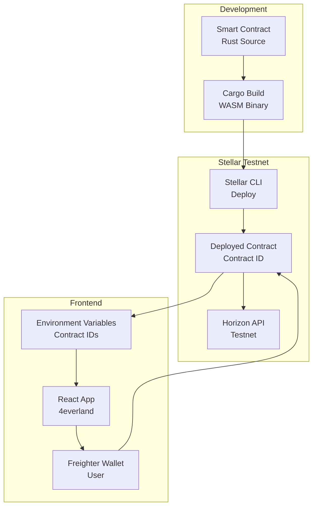
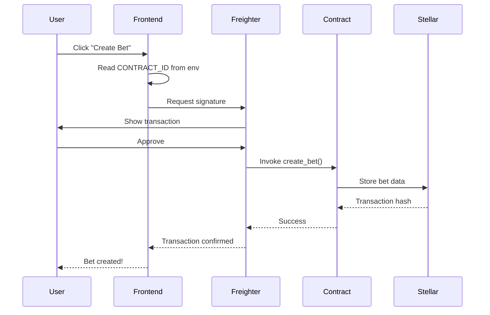

# Design Document: Stellar Smart Contract Deployment

## Overview

This document provides the technical design for deploying PolyPulse's two Soroban smart contracts to Stellar testnet. The deployment process involves building WASM binaries, deploying to testnet, configuring the frontend, and verifying end-to-end functionality.

## Architecture

### Deployment Architecture



### Contract Interaction Flow



## Component Design

### 1. Build System

**Tool**: Stellar CLI + Cargo

**Build Process**:
```bash
# 1. Install target
rustup target add wasm32-unknown-unknown

# 2. Build contract
cd contracts/contracts/market
cargo build --target wasm32-unknown-unknown --release

# 3. Optimize WASM
stellar contract optimize \
  --wasm target/wasm32-unknown-unknown/release/market.wasm
```

**Output**:
- `market.wasm` - P2P bet contract binary
- `multi_pool.wasm` - Multi-pool contract binary

**Size Optimization**:
- Strip debug symbols
- Use `opt-level = "z"` in Cargo.toml
- Run wasm-opt for further optimization

### 2. Deployment System

**Tool**: Stellar CLI

**Deployment Command**:
```bash
stellar contract deploy \
  --wasm <path_to_wasm> \
  --source <deployer_identity> \
  --network testnet
```

**Process**:
1. Read WASM binary
2. Submit to Stellar network
3. Network validates and stores contract
4. Returns unique contract ID (C...)
5. Contract is now callable

**Contract ID Format**:
- Starts with 'C'
- 56 characters long
- Base32 encoded
- Example: `CAAAAAAAAAAAAAAAAAAAAAAAAAAAAAAAAAAAAAAAAAAAAAAAAAAAD2KM`

### 3. Frontend Configuration

**Environment Variables**:
```bash
# .env.production
VITE_STELLAR_MARKET_CONTRACT_ID=<P2P_CONTRACT_ID>
VITE_STELLAR_MULTIPOOL_CONTRACT_ID=<MULTI_POOL_CONTRACT_ID>
VITE_STELLAR_NETWORK=testnet
VITE_HORIZON_URL=https://horizon-testnet.stellar.org
VITE_SOROBAN_RPC_URL=https://soroban-testnet.stellar.org
```

**4everland Configuration**:
- Go to project settings
- Add environment variables
- Trigger redeploy
- Verify variables in build logs

**Frontend Usage**:
```typescript
// Read contract ID from environment
const contractId = import.meta.env.VITE_STELLAR_MARKET_CONTRACT_ID;

// Create contract instance
const contract = new Contract(contractId);

// Invoke contract function
const result = await contract.call('create_bet', {
  creator: userAddress,
  question: 'Will it rain?',
  stake: 1000000,
  end_time: endTimestamp,
});
```

### 4. Contract Invocation

**Stellar SDK Integration**:
```typescript
import { Contract, SorobanRpc } from '@stellar/stellar-sdk';

// Initialize RPC client
const rpc = new SorobanRpc.Server(
  import.meta.env.VITE_SOROBAN_RPC_URL
);

// Create contract instance
const contract = new Contract(contractId);

// Build transaction
const tx = new TransactionBuilder(account, {
  fee: BASE_FEE,
  networkPassphrase: Networks.TESTNET,
})
  .addOperation(contract.call('create_bet', ...args))
  .setTimeout(30)
  .build();

// Sign with Freighter
const signedTx = await freighter.signTransaction(tx.toXDR());

// Submit to network
const result = await rpc.sendTransaction(signedTx);
```

## Data Flow

### Deployment Data Flow

```
1. Source Code (Rust)
   ↓
2. Cargo Build → WASM Binary
   ↓
3. Stellar CLI → Upload to Network
   ↓
4. Network Validation → Store Contract
   ↓
5. Return Contract ID
   ↓
6. Save to Environment Variables
   ↓
7. Frontend Reads Contract ID
   ↓
8. User Invokes Contract
```

### Transaction Data Flow

```
User Action
  ↓
Frontend builds transaction
  ↓
Freighter signs transaction
  ↓
Submit to Soroban RPC
  ↓
Network validates
  ↓
Contract executes
  ↓
State updated on-chain
  ↓
Transaction hash returned
  ↓
Frontend polls for confirmation
  ↓
UI updates with result
```

## Implementation Plan

### Phase 1: Environment Setup (15 minutes)

**Steps**:
1. Install Stellar CLI
   ```bash
   cargo install --locked stellar-cli --features opt
   ```

2. Verify installation
   ```bash
   stellar --version
   ```

3. Configure testnet
   ```bash
   stellar network add \
     --global testnet \
     --rpc-url https://soroban-testnet.stellar.org:443 \
     --network-passphrase "Test SDF Network ; September 2015"
   ```

4. Create deployer identity
   ```bash
   stellar keys generate deployer --network testnet
   ```

5. Fund deployer account
   ```bash
   stellar keys fund deployer --network testnet
   ```

6. Verify balance
   ```bash
   stellar keys address deployer
   # Copy address and check on https://stellar.expert/explorer/testnet
   ```

### Phase 2: Build Contracts (10 minutes)

**P2P Bet Contract**:
```bash
cd contracts/contracts/market
stellar contract build
```

**Multi-Pool Contract**:
```bash
cd contracts/contracts/multi-pool
stellar contract build
```

**Verify builds**:
```bash
ls -lh ../../target/wasm32-unknown-unknown/release/*.wasm
```

**Expected output**:
```
-rw-r--r-- 1 user user 150K market.wasm
-rw-r--r-- 1 user user 180K multi_pool.wasm
```

### Phase 3: Deploy P2P Contract (10 minutes)

**Deploy**:
```bash
cd contracts/contracts/market
stellar contract deploy \
  --wasm ../../target/wasm32-unknown-unknown/release/market.wasm \
  --source deployer \
  --network testnet
```

**Expected output**:
```
CAAAAAAAAAAAAAAAAAAAAAAAAAAAAAAAAAAAAAAAAAAAAAAAAAAAD2KM
```

**Save contract ID**:
```bash
export P2P_CONTRACT_ID="<returned_contract_id>"
echo "P2P Contract ID: $P2P_CONTRACT_ID" >> ../../DEPLOYED_CONTRACTS.txt
```

**Verify deployment**:
```bash
stellar contract invoke \
  --id $P2P_CONTRACT_ID \
  --source deployer \
  --network testnet \
  -- \
  --help
```

**Expected**: List of available functions

### Phase 4: Deploy Multi-Pool Contract (10 minutes)

**Deploy**:
```bash
cd contracts/contracts/multi-pool
stellar contract deploy \
  --wasm ../../target/wasm32-unknown-unknown/release/multi_pool.wasm \
  --source deployer \
  --network testnet
```

**Expected output**:
```
CBBBBBBBBBBBBBBBBBBBBBBBBBBBBBBBBBBBBBBBBBBBBBBBBBBBBBD3LN
```

**Save contract ID**:
```bash
export MULTI_POOL_CONTRACT_ID="<returned_contract_id>"
echo "Multi-Pool Contract ID: $MULTI_POOL_CONTRACT_ID" >> ../../DEPLOYED_CONTRACTS.txt
```

**Verify deployment**:
```bash
stellar contract invoke \
  --id $MULTI_POOL_CONTRACT_ID \
  --source deployer \
  --network testnet \
  -- \
  --help
```

### Phase 5: Configure Frontend (10 minutes)

**Update .env.production**:
```bash
cd frontend
cat >> .env.production << EOF
VITE_STELLAR_MARKET_CONTRACT_ID=$P2P_CONTRACT_ID
VITE_STELLAR_MULTIPOOL_CONTRACT_ID=$MULTI_POOL_CONTRACT_ID
EOF
```

**Update 4everland**:
1. Go to https://dashboard.4everland.org
2. Select PolyPulse project
3. Go to Settings → Environment Variables
4. Add:
   - `VITE_STELLAR_MARKET_CONTRACT_ID` = `<P2P_CONTRACT_ID>`
   - `VITE_STELLAR_MULTIPOOL_CONTRACT_ID` = `<MULTI_POOL_CONTRACT_ID>`
5. Click "Save"
6. Trigger redeploy

**Commit changes**:
```bash
git add frontend/.env.production contracts/DEPLOYED_CONTRACTS.txt
git commit -m "feat: Add deployed contract IDs for testnet"
git push origin main
```

### Phase 6: Test Contracts (20 minutes)

**Test P2P Contract - Create Bet**:
```bash
stellar contract invoke \
  --id $P2P_CONTRACT_ID \
  --source deployer \
  --network testnet \
  -- \
  create_bet \
  --creator $(stellar keys address deployer) \
  --question "Will it rain tomorrow?" \
  --stake 10000000 \
  --end_time 1735689600
```

**Expected**: Bet ID returned (e.g., `1`)

**Test P2P Contract - Get Bet**:
```bash
stellar contract invoke \
  --id $P2P_CONTRACT_ID \
  --source deployer \
  --network testnet \
  -- \
  get_bet \
  --bet_id 1
```

**Expected**: Bet details JSON

**Test Multi-Pool Contract - Create Pool**:
```bash
stellar contract invoke \
  --id $MULTI_POOL_CONTRACT_ID \
  --source deployer \
  --network testnet \
  -- \
  create_pool \
  --creator $(stellar keys address deployer) \
  --question "Will BTC reach $100k?" \
  --end_time 1735689600
```

**Expected**: Pool ID returned (e.g., `1`)

**Test Multi-Pool Contract - Join Pool**:
```bash
stellar contract invoke \
  --id $MULTI_POOL_CONTRACT_ID \
  --source deployer \
  --network testnet \
  -- \
  join_pool \
  --participant $(stellar keys address deployer) \
  --pool_id 1 \
  --position true \
  --stake 10000000
```

**Expected**: Success confirmation

### Phase 7: End-to-End Testing (15 minutes)

**Frontend Testing**:
1. Open https://polypulse-m11gtupi-dgithinjibit.ipfs.4everland.app
2. Open browser console (F12)
3. Check for contract ID logs
4. Connect Freighter wallet (testnet mode)
5. Fund wallet from friendbot if needed:
   ```
   https://friendbot.stellar.org?addr=<your_address>
   ```
6. Click "Create Bet"
7. Fill in:
   - Question: "Will it rain tomorrow?"
   - Stake: 10 XLM
   - End time: Tomorrow
8. Click "Create"
9. Approve transaction in Freighter
10. Wait for confirmation
11. Verify bet appears in list

**Expected Results**:
- ✅ Transaction signed successfully
- ✅ Transaction submitted to network
- ✅ Transaction confirmed (hash displayed)
- ✅ Bet appears in UI
- ✅ Bet details correct

### Phase 8: Documentation (10 minutes)

**Create DEPLOYMENT_GUIDE.md**:
```markdown
# Smart Contract Deployment Guide

## Deployed Contracts (Testnet)

### P2P Bet Contract
- **Contract ID**: `<P2P_CONTRACT_ID>`
- **Network**: Stellar Testnet
- **Deployed**: 2026-04-24
- **Deployer**: `<deployer_address>`

### Multi-Pool Contract
- **Contract ID**: `<MULTI_POOL_CONTRACT_ID>`
- **Network**: Stellar Testnet
- **Deployed**: 2026-04-24
- **Deployer**: `<deployer_address>`

## Verification

Test contracts at:
- Stellar Expert: https://stellar.expert/explorer/testnet/contract/<CONTRACT_ID>
- Horizon: https://horizon-testnet.stellar.org/contracts/<CONTRACT_ID>

## Frontend Configuration

Environment variables set in 4everland:
- `VITE_STELLAR_MARKET_CONTRACT_ID`
- `VITE_STELLAR_MULTIPOOL_CONTRACT_ID`

## Redeployment

To redeploy contracts:
1. Build: `stellar contract build`
2. Deploy: `stellar contract deploy --wasm <path> --source deployer --network testnet`
3. Update frontend env vars
4. Redeploy frontend

## Troubleshooting

### Contract not found
- Verify contract ID is correct
- Check network (testnet vs mainnet)
- Verify RPC URL is correct

### Transaction fails
- Check account balance
- Verify function arguments
- Check contract state

### Frontend can't connect
- Verify env vars are set
- Check browser console for errors
- Verify Freighter is on testnet
```

## Error Handling

### Deployment Errors

**Error**: `account not found`
**Fix**: Fund deployer account from friendbot
```bash
stellar keys fund deployer --network testnet
```

**Error**: `insufficient balance`
**Fix**: Request more XLM from friendbot
```bash
curl "https://friendbot.stellar.org?addr=$(stellar keys address deployer)"
```

**Error**: `network timeout`
**Fix**: Retry deployment, check network status
```bash
# Check network status
curl https://soroban-testnet.stellar.org/health
```

**Error**: `invalid wasm`
**Fix**: Rebuild contract
```bash
cargo clean
stellar contract build
```

### Invocation Errors

**Error**: `function not found`
**Fix**: Verify function name and arguments
```bash
stellar contract invoke --id $CONTRACT_ID --network testnet -- --help
```

**Error**: `authorization failed`
**Fix**: Ensure correct source account
```bash
stellar contract invoke --id $CONTRACT_ID --source deployer --network testnet -- ...
```

**Error**: `transaction failed`
**Fix**: Check contract state and arguments
```bash
# Get contract info
stellar contract info --id $CONTRACT_ID --network testnet
```

## Testing Strategy

### Unit Tests (Pre-Deployment)

Run contract tests before deploying:
```bash
cd contracts/contracts/market
cargo test
```

**Expected**: All tests pass

### Integration Tests (Post-Deployment)

Test deployed contracts:
```bash
# Test create_bet
stellar contract invoke --id $P2P_CONTRACT_ID --source deployer --network testnet -- create_bet ...

# Test join_bet
stellar contract invoke --id $P2P_CONTRACT_ID --source deployer --network testnet -- join_bet ...

# Test get_bet
stellar contract invoke --id $P2P_CONTRACT_ID --source deployer --network testnet -- get_bet ...
```

### End-to-End Tests

Test via frontend:
1. Create bet via UI
2. Join bet with second account
3. Report outcome
4. Verify payout

## Performance Considerations

### Gas Costs

**P2P Contract**:
- `create_bet`: ~0.01 XLM
- `join_bet`: ~0.01 XLM
- `report_outcome`: ~0.005 XLM
- `execute_payout`: ~0.01 XLM

**Multi-Pool Contract**:
- `create_pool`: ~0.01 XLM
- `join_pool`: ~0.01 XLM
- `distribute_payouts`: ~0.05 XLM (scales with participants)

### Optimization

**WASM Size**:
- Current: ~150-180 KB
- Optimized: ~100-120 KB (with wasm-opt)

**Execution Time**:
- Simple functions: <100ms
- Complex functions: <500ms

## Rollback Plan

### If Deployment Fails

1. **Check error logs**
2. **Fix issue locally**
3. **Rebuild contract**
4. **Redeploy**

### If Contract Has Bugs

1. **Deploy new version** (contracts are immutable)
2. **Update frontend** with new contract ID
3. **Migrate data** if needed
4. **Deprecate old contract**

### If Frontend Breaks

1. **Revert env vars** to previous contract IDs
2. **Redeploy frontend**
3. **Fix issues**
4. **Redeploy with correct IDs**

## Success Metrics

### Deployment Metrics
- ✅ Both contracts deployed
- ✅ Contract IDs obtained
- ✅ Contracts accessible via CLI
- ✅ Contracts respond to invocations

### Configuration Metrics
- ✅ Frontend env vars updated
- ✅ 4everland env vars updated
- ✅ Frontend rebuilt successfully
- ✅ Contract IDs in browser console

### Functionality Metrics
- ✅ Can create bet via CLI
- ✅ Can join bet via CLI
- ✅ Can create bet via frontend
- ✅ Can join bet via frontend
- ✅ Transactions confirm on testnet

## Related Documents

- `requirements.md` - Requirements for deployment
- `CURRENT_FEATURES_SUMMARY.md` - Platform status
- Stellar docs: https://developers.stellar.org/docs/smart-contracts
- Soroban docs: https://soroban.stellar.org/docs
